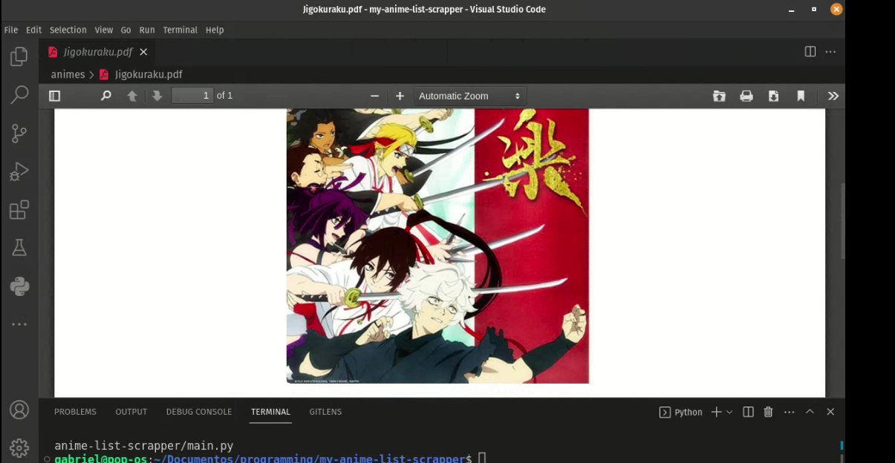

<h1 align="center">mal_seasonal_animes<h1>

**a anime seasonal getter using MAL API, this transform the data to PDF**

the script get data seasonal from **MAL API** and transform this in HTML to format in PDF using ***jinja2*** and ***pdfkit***

# dependencies

to download the dependencies:

- `pip install -r requirements.txt`

# referencies:

- ***https://myanimelist.net/apiconfig/references/api/v2***

- ***https://towardsdatascience.com/how-to-easily-create-a-pdf-file-with-python-in-3-steps-a70faaf5bed5***
